# Діаграма архітектури Pentester Application

```mermaid
graph TB
    subgraph "Desktop Application Layer"
        APP[app.py<br/>Entry Point + Jinja2]
        WEBVIEW[pywebview<br/>Desktop Window]
        API_CLASS[server.py<br/>PyWebView API Class]
    end

    subgraph "Python API Methods"
        GET_VM_STATUS[get_vm_status<br/>VM Status]
        SCAN_NETS[scan_networks<br/>WPS Network Scan]
        WPS_TEST[wps_test<br/>WPS Testing]
        GET_HS_FILES[get_handshake_files<br/>List Handshake Files]
        GET_DICT_FILES[get_dictionary_files<br/>List Dictionary Files]
        HS_SCAN_NETS[handshake_scan_networks<br/>Handshake Network Scan]
        CAPTURE_HS[capture_handshake<br/>Handshake Capture]
        DECRYPT_BF[decrypt_bruteforce<br/>Brute Force]
        DECRYPT_DICT[decrypt_dictionary<br/>Dictionary Attack]
        NMAP_SCAN[nmap_scan<br/>Port Scanning]
        CUPP_GEN[cupp_generate<br/>Wordlist Generation]
        AUTO_SCAN[auto_scan_networks<br/>Combined Network Scan]
        AUTO_TEST[auto_test_network<br/>Auto Security Test]
        GET_SETTINGS[get_settings<br/>Get Settings]
        UPDATE_SETTINGS[update_settings<br/>Update Settings]
        NAVIGATE[navigate<br/>Page Navigation]
    end

    subgraph "Utils Layer (lib/)"
        VM_UTILS[vm_utils.py<br/>VM Management]
        WPS_UTILS[wps_utils.py<br/>WPS & Network Scan]
        HS_UTILS[handshake_utils.py<br/>Handshake Operations]
        SSH_UTILS[ssh_utils.py<br/>SSH Connection]
        DICT_UTILS[dict_utils.py<br/>Dictionary Utils]
        NET_UTILS[network_utils.py<br/>Network Utilities]
        NMAP_UTILS[nmap_utils.py<br/>Nmap Utilities]
        CONFIG[config.py<br/>Configuration]
        CUPP[cupp.py<br/>CUPP Tool]
    end

    subgraph "Frontend Layer"
        HTML[index.html<br/>Main Template]
        JS_SHARED[shared.js<br/>Common Functions]
        JS_AUTO[auto.js<br/>Auto Mode]
        JS_WPS[wps.js<br/>WPS Testing]
        JS_HS[handshake.js<br/>Handshake Operations]
        JS_NMAP[nmap.js<br/>Nmap Scanning]
        JS_DICT[dictionaries.js<br/>CUPP Generation]
        JS_SETT[settings.js<br/>Settings]
        JS_INDEX[index.js<br/>Navigation]
        CSS[style.css<br/>Custom Styles]
    end

    subgraph "HTML Partials"
        PART_AUTO[auto/_auto.html<br/>Auto Mode Sections]
        PART_WPS[wps/_wps.html<br/>WPS Interface]
        PART_HS_INT[handshake/interception/<br/>Interception UI]
        PART_HS_DEC[handshake/decryption/<br/>Decryption UI]
        PART_NMAP[nmap/_nmap.html<br/>Nmap Interface]
        PART_DICT[dictionaries/_dictionaries.html<br/>CUPP Interface]
        PART_SETT[settings/_settings.html<br/>Settings Interface]
    end

    subgraph "Storage Layer (lib/)"
        SETTINGS_JSON[settings.json<br/>Application Settings]
        HANDSHAKE_DIR[handshake/<br/>Handshake Files]
        DICT_DIR[dict/<br/>Dictionary Files]
        CONVERT_DIR[convert/<br/>Converted Files]
    end

    subgraph "External Systems"
        VBOX[VirtualBox<br/>VM Manager]
        KALI_VM[Kali Linux VM<br/>Penetration Testing]
        WIFI[Wi-Fi Networks<br/>Target Networks]
    end

    %% Desktop App Flow
    APP -->|Creates| WEBVIEW
    APP -->|Renders with Jinja2| HTML
    APP -->|Creates| API_CLASS
    WEBVIEW -->|JS API Bridge| API_CLASS

    %% API Methods
    API_CLASS --> GET_VM_STATUS
    API_CLASS --> SCAN_NETS
    API_CLASS --> WPS_TEST
    API_CLASS --> GET_HS_FILES
    API_CLASS --> GET_DICT_FILES
    API_CLASS --> HS_SCAN_NETS
    API_CLASS --> CAPTURE_HS
    API_CLASS --> DECRYPT_BF
    API_CLASS --> DECRYPT_DICT
    API_CLASS --> NMAP_SCAN
    API_CLASS --> CUPP_GEN
    API_CLASS --> AUTO_SCAN
    API_CLASS --> AUTO_TEST
    API_CLASS --> GET_SETTINGS
    API_CLASS --> UPDATE_SETTINGS
    API_CLASS --> NAVIGATE

    %% API to Utils
    GET_VM_STATUS --> VM_UTILS
    SCAN_NETS --> WPS_UTILS
    WPS_TEST --> WPS_UTILS
    HS_SCAN_NETS --> HS_UTILS
    CAPTURE_HS --> HS_UTILS
    DECRYPT_BF --> HS_UTILS
    DECRYPT_DICT --> HS_UTILS
    AUTO_SCAN --> WPS_UTILS
    AUTO_SCAN --> HS_UTILS
    AUTO_TEST --> WPS_UTILS
    AUTO_TEST --> HS_UTILS
    NMAP_SCAN --> NMAP_UTILS
    CUPP_GEN --> CUPP
    WPS_UTILS --> SSH_UTILS
    HS_UTILS --> SSH_UTILS
    VM_UTILS --> SSH_UTILS
    NMAP_UTILS --> SSH_UTILS
    CUPP --> DICT_UTILS

    %% Utils to External
    VM_UTILS --> VBOX
    VM_UTILS --> KALI_VM
    SSH_UTILS --> KALI_VM
    WPS_UTILS --> WIFI
    HS_UTILS --> WIFI

    %% Utils to Storage & Config
    VM_UTILS --> CONFIG
    WPS_UTILS --> CONFIG
    HS_UTILS --> CONFIG
    NMAP_UTILS --> CONFIG
    GET_SETTINGS --> SETTINGS_JSON
    UPDATE_SETTINGS --> SETTINGS_JSON
    GET_HS_FILES --> HANDSHAKE_DIR
    GET_DICT_FILES --> DICT_DIR
    CAPTURE_HS --> HANDSHAKE_DIR
    DECRYPT_BF --> HANDSHAKE_DIR
    DECRYPT_DICT --> HANDSHAKE_DIR
    DECRYPT_DICT --> DICT_DIR
    CUPP_GEN --> DICT_DIR
    DECRYPT_BF --> CONVERT_DIR
    DECRYPT_DICT --> CONVERT_DIR

    %% Frontend Flow
    HTML --> PART_AUTO
    HTML --> PART_WPS
    HTML --> PART_HS_INT
    HTML --> PART_HS_DEC
    HTML --> PART_NMAP
    HTML --> PART_DICT
    HTML --> PART_SETT
    HTML --> CSS

    %% JavaScript to Partials
    JS_AUTO -.->|Controls| PART_AUTO
    JS_WPS -.->|Controls| PART_WPS
    JS_HS -.->|Controls| PART_HS_INT
    JS_HS -.->|Controls| PART_HS_DEC
    JS_NMAP -.->|Controls| PART_NMAP
    JS_DICT -.->|Controls| PART_DICT
    JS_SETT -.->|Controls| PART_SETT
    JS_INDEX -.->|Navigation| HTML

    %% Frontend to API (via pywebview.api)
    JS_SHARED -.->|pywebview.api| GET_VM_STATUS
    JS_AUTO -.->|pywebview.api| AUTO_SCAN
    JS_AUTO -.->|pywebview.api| AUTO_TEST
    JS_WPS -.->|pywebview.api| SCAN_NETS
    JS_WPS -.->|pywebview.api| WPS_TEST
    JS_HS -.->|pywebview.api| GET_HS_FILES
    JS_HS -.->|pywebview.api| GET_DICT_FILES
    JS_HS -.->|pywebview.api| HS_SCAN_NETS
    JS_HS -.->|pywebview.api| CAPTURE_HS
    JS_HS -.->|pywebview.api| DECRYPT_BF
    JS_HS -.->|pywebview.api| DECRYPT_DICT
    JS_NMAP -.->|pywebview.api| NMAP_SCAN
    JS_DICT -.->|pywebview.api| CUPP_GEN
    JS_SETT -.->|pywebview.api| GET_SETTINGS
    JS_SETT -.->|pywebview.api| UPDATE_SETTINGS
    JS_INDEX -.->|pywebview.api| NAVIGATE

    %% Event System
    API_CLASS -.->|CustomEvents| JS_SHARED
    API_CLASS -.->|Progress Events| JS_AUTO
    API_CLASS -.->|Progress Events| JS_WPS
    API_CLASS -.->|Progress Events| JS_HS
    API_CLASS -.->|Progress Events| JS_NMAP
    API_CLASS -.->|Settings Events| JS_SETT

    %% Styling
    classDef desktopApp fill:#4A90E2,stroke:#2E5C8A,stroke-width:2px,color:#fff
    classDef apiMethod fill:#00C853,stroke:#007E33,stroke-width:2px,color:#fff
    classDef utils fill:#9C27B0,stroke:#6A1B9A,stroke-width:2px,color:#fff
    classDef frontend fill:#F44336,stroke:#C62828,stroke-width:2px,color:#fff
    classDef storage fill:#607D8B,stroke:#37474F,stroke-width:2px,color:#fff
    classDef external fill:#FF9800,stroke:#E65100,stroke-width:2px,color:#fff

    class APP,WEBVIEW,API_CLASS desktopApp
    class GET_VM_STATUS,SCAN_NETS,WPS_TEST,GET_HS_FILES,GET_DICT_FILES,HS_SCAN_NETS,CAPTURE_HS,DECRYPT_BF,DECRYPT_DICT,NMAP_SCAN,CUPP_GEN,AUTO_SCAN,AUTO_TEST,GET_SETTINGS,UPDATE_SETTINGS,NAVIGATE apiMethod
    class VM_UTILS,WPS_UTILS,HS_UTILS,SSH_UTILS,DICT_UTILS,NET_UTILS,NMAP_UTILS,CONFIG,CUPP utils
    class HTML,JS_SHARED,JS_AUTO,JS_WPS,JS_HS,JS_NMAP,JS_DICT,JS_SETT,JS_INDEX,CSS,PART_AUTO,PART_WPS,PART_HS_INT,PART_HS_DEC,PART_NMAP,PART_DICT,PART_SETT frontend
    class SETTINGS_JSON,HANDSHAKE_DIR,DICT_DIR,CONVERT_DIR storage
    class VBOX,KALI_VM,WIFI external
```

## Компоненти архітектури

### Desktop Application Layer

-   **app.py**: Головна точка входу додатку
    -   Запускає PyWebView вікно (1440x850)
    -   Рендерить HTML через Jinja2
    -   Створює API клас для JS ↔ Python комунікації
    -   Читає статичні файли (CSS, JS)
-   **server.py**: PyWebView API клас
    -   Містить усі Python методи, доступні з JavaScript
    -   Обробляє події та відправляє прогрес на фронтенд
    -   Управляє налаштуваннями (зберігання у JSON)
    -   Реалізує навігацію між сторінками
-   **pywebview**: Вбудований веб-переглядач для desktop інтерфейсу

### Python API Methods (server.py)

#### VM та мережеві операції

-   **get_vm_status()**: Перевірка статусу підключення до VM
-   **scan_networks()**: Сканування доступних Wi-Fi мереж через WPS (wash)
-   **wps_test()**: Тестування WPS вразливостей через reaver

#### Handshake операції

-   **get_handshake_files()**: Отримання списку файлів handshake з локальної папки
-   **get_dictionary_files()**: Отримання списку файлів словників з локальної папки
-   **handshake_scan_networks()**: Сканування WiFi мереж для перехоплення handshake (airodump-ng)
-   **capture_handshake()**: Перехоплення handshake з прогресом (deauth атака)
-   **decrypt_bruteforce()**: Brute force розшифрування handshake з прогресом
-   **decrypt_dictionary()**: Dictionary attack розшифрування handshake з прогресом

#### Автоматичне тестування

-   **auto_scan_networks()**: Комбіноване сканування мереж (WPS + Handshake сканування)
-   **auto_test_network()**: Автоматичне тестування безпеки мережі (WPS Pixie Dust → Handshake capture → Dictionary attack)

#### Інші інструменти

-   **nmap_scan()**: Сканування портів через Nmap з прогресом
-   **cupp_generate()**: Генерація персоналізованих словників через CUPP

#### Налаштування та навігація

-   **get_settings()**: Отримання поточних налаштувань
-   **update_settings()**: Оновлення налаштувань (тема, VM параметри)
-   **navigate()**: Зміна сторінки (auto, wps, interception, decryption, nmap, dictionaries, settings)

### Utils Layer (lib/)

-   **vm_utils.py**: Управління віртуальною машиною
    -   Ініціалізація та запуск VM через VirtualBox
    -   Перевірка статусу підключення
    -   Отримання IP адреси VM
    -   Налаштування ресурсів VM (CPU, RAM)
-   **wps_utils.py**: WPS та мережеве сканування
    -   Сканування Wi-Fi мереж через wash
    -   WPS атаки через reaver (Pixie Dust)
    -   Парсинг результатів сканування
-   **handshake_utils.py**: Операції з handshake
    -   Сканування WiFi мереж через airodump-ng
    -   Перехоплення handshake (deauth атака)
    -   Конвертація .cap в .hccapx для hashcat
    -   Brute force розшифрування через hashcat
    -   Dictionary attack розшифрування через hashcat
    -   Парсинг результатів сканування та розшифрування
-   **nmap_utils.py**: Nmap сканування
    -   Виконання nmap команд через SSH
    -   Парсинг результатів сканування портів
    -   Підтримка різних типів сканування (standard, version detection, OS detection)
-   **ssh_utils.py**: SSH з'єднання з Kali VM
    -   Встановлення SSH сесій через paramiko
    -   Виконання команд на віддаленій машині
    -   Копіювання файлів через SFTP
    -   Управління WiFi інтерфейсами
-   **dict_utils.py**: Робота зі словниками
    -   Генерація словників через CUPP
    -   Управління файлами словників
-   **network_utils.py**: Загальні мережеві утиліти
    -   Парсинг мережевих даних
    -   Утиліти для роботи з шляхами
-   **config.py**: Конфігурація додатку (VM параметри, шляхи)
-   **cupp.py**: Інтеграція CUPP для генерації словників

### Frontend Layer

#### HTML Templates (Jinja2)

-   **index.html**: Головний шаблон з навігацією та глобальною консоллю
-   **Partials**:
    -   `auto/`: Auto режим
        -   `start-section.html`: Початковий екран з кнопкою запуску
        -   `networks-section.html`: Список знайдених мереж
        -   `progress-section.html`: Прогрес тестування
        -   `results-section.html`: Результати тестування з рекомендаціями
    -   `wps/`: WPS тестування
    -   `handshake/interception/`: Перехоплення handshake
    -   `handshake/decryption/`: Розшифрування
        -   `bruteforce-subtab.html`: Brute force інтерфейс
        -   `dictionary-subtab.html`: Dictionary attack інтерфейс
    -   `nmap/`: Nmap сканування портів
    -   `dictionaries/`: CUPP генерація словників
    -   `settings/`: Налаштування додатку

#### JavaScript Modules

-   **shared.js**: Загальні функції (API виклики, UI хелпери)
-   **index.js**: Навігація між сторінками
-   **auto.js**: Логіка Auto режиму
-   **wps.js**: Логіка WPS тестування
-   **handshake.js**: Логіка handshake операцій
-   **nmap.js**: Логіка Nmap сканування
-   **dictionaries.js**: Логіка CUPP генерації
-   **settings.js**: Логіка налаштувань

#### Styles

-   **style.css**: Кастомні стилі з підтримкою темної теми

### Communication Layer

-   **PyWebView JS API Bridge**: JavaScript викликає Python методи через `pywebview.api.method_name()`
-   **CustomEvents**: Python відправляє події на фронтенд через `window.dispatchEvent()`
-   **Progress Events**: Реал-тайм оновлення прогресу операцій

### Storage Layer (lib/)

-   **settings.json**: Налаштування додатку (тема, VM параметри: CPU, RAM)
-   **handshake/**: Перехоплені handshake файли (.cap, .hccapx, .pcap)
-   **dict/**: Словники для dictionary атак (.txt, .lst, .dic)
    -   Вбудовані словники: rockyou.txt, probable-v2-wpa-top4800.txt
-   **convert/**: Конвертовані файли для hashcat (.hccapx)
-   **cupp.cfg**: Конфігурація CUPP для генерації словників

### External Systems

-   **VirtualBox**: Менеджер віртуальних машин (через VBoxManage)
-   **Kali Linux VM**: Платформа для пентестування (за замовчуванням "MAN")
-   **Wi-Fi Networks**: Цільові мережі для аналізу

## Ключові особливості архітектури

### PyWebView Desktop Framework

Додаток використовує **PyWebView** для desktop інтерфейсу та комунікації:

-   ✅ Прямі виклики Python методів з JavaScript
-   ✅ Немає HTTP overhead
-   ✅ Вбудований браузер (не потрібен зовнішній)
-   ✅ CustomEvents для real-time оновлень

### Event-Driven Communication

-   Python → JavaScript: CustomEvents через `window.dispatchEvent()`
-   JavaScript → Python: Прямі виклики через `pywebview.api.*`
-   Progress tracking: Події з даними прогресу операцій

### Модульна Frontend структура

-   Jinja2 partials для кожної функціональності
-   Окремі JS модулі для кожної сторінки
-   Спільні функції в `shared.js`

### Асинхронність

-   VM ініціалізація в окремому потоці (daemon thread)
-   Прогрес операцій через події (CustomEvents)
-   Неблокуючі операції на фронтенді
-   Асинхронне виконання команд через SSH

### Автоматичне тестування

-   **Комбіноване сканування**: Об'єднує результати WPS та Handshake сканування
-   **Послідовне тестування**: WPS Pixie Dust → Handshake Capture → Dictionary Attack
-   **Рекомендації**: Генерація рекомендацій з безпеки на основі результатів тестування
-   **Прогрес у реальному часі**: Окремі події для кожної фази тестування

### Handshake Workflow

-   **Сканування**: airodump-ng для виявлення мереж
-   **Перехоплення**: Deauth атака для форсування handshake
-   **Конвертація**: Автоматична конвертація .cap → .hccapx
-   **Розшифрування**: Hashcat для brute force та dictionary атак
-   **Прогрес**: Real-time оновлення прогресу через події
